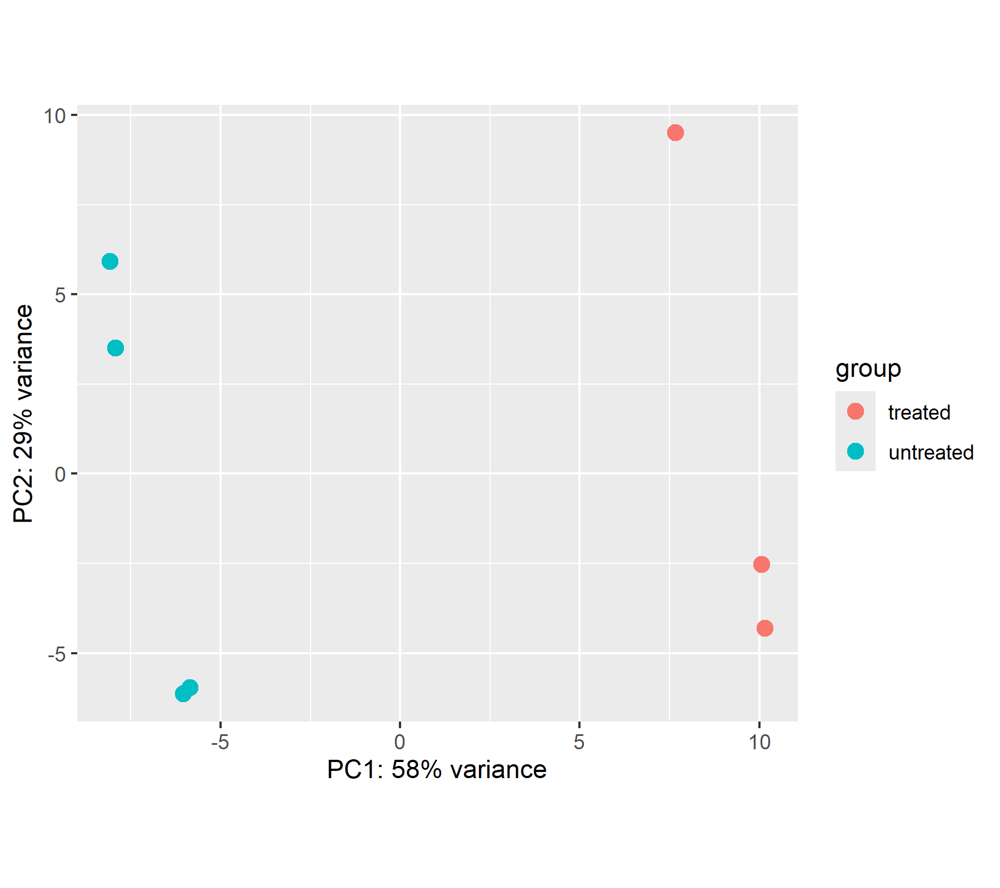
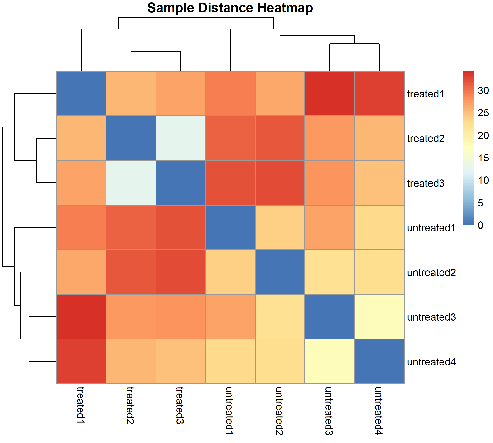
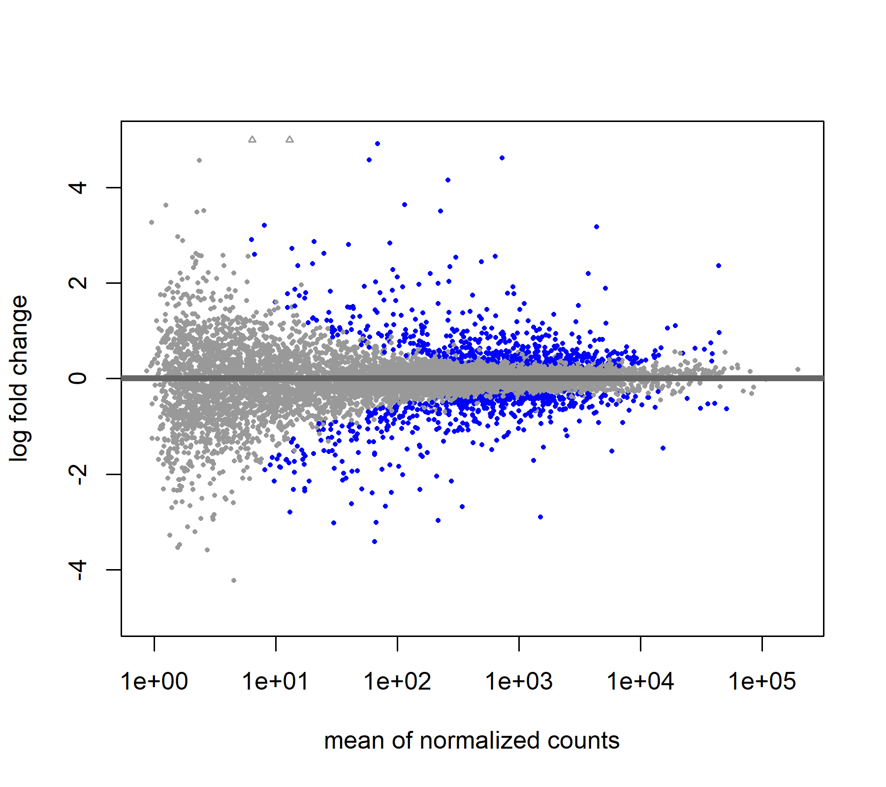
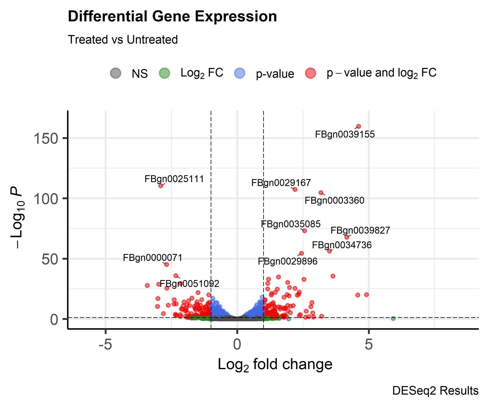
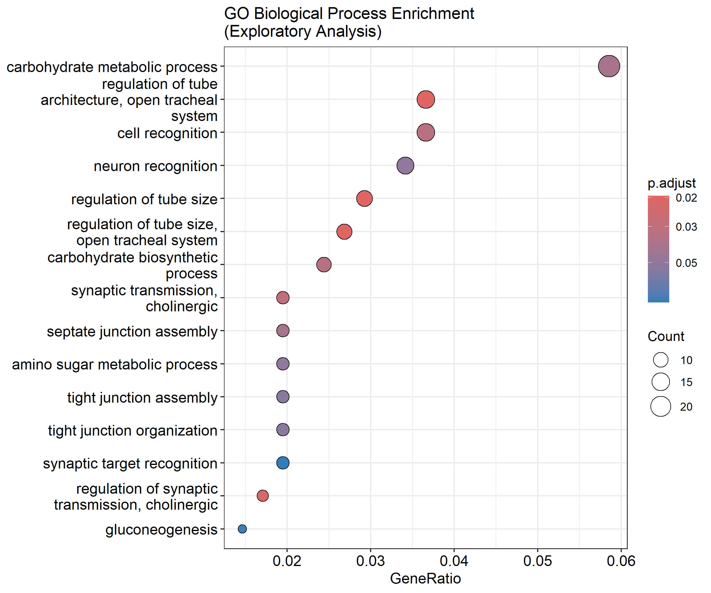
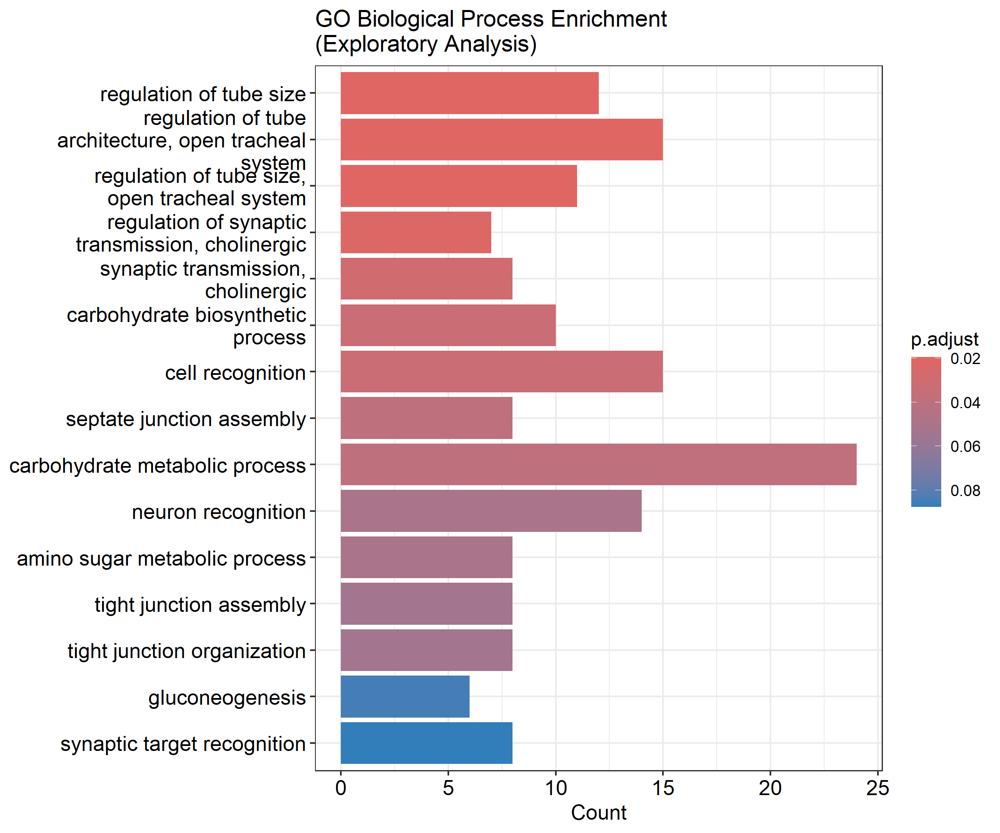
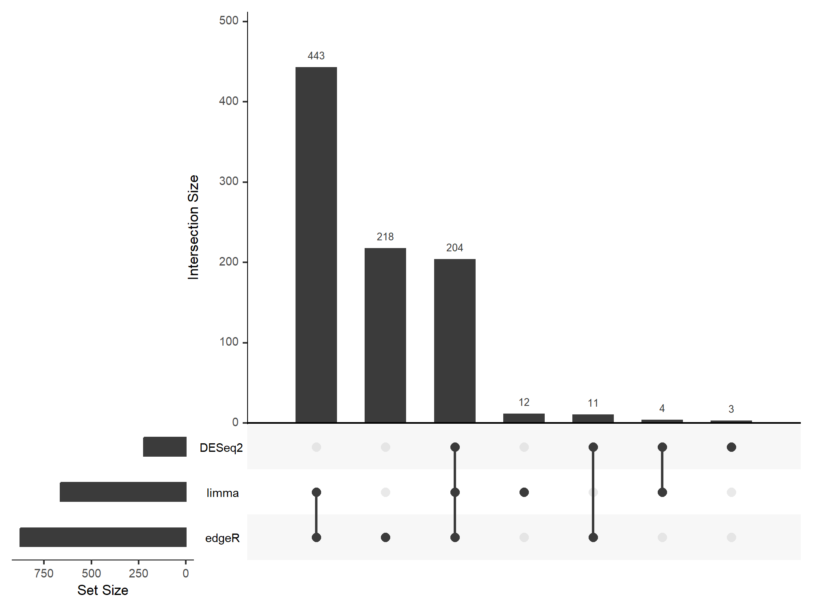

# RNA-Seq Differential Expression Analysis Pipeline using DESeq2, edgeR and limma-voom


A comprehensive RNA-seq differential expression analysis workflow using the **Pasilla RNA-seq dataset** from *Drosophila melanogaster*. This project compares three widely used Bioconductor differential expression frameworks (**DESeq2**, **edgeR**, and **limma-voom**) to identify differentially expressed genes (DEGs), perform functional enrichment analysis, and generate publication-quality visualizations.

The project demonstrates an end-to-end RNA-seq analysis pipeline including quality assessment, normalization, differential expression analysis, Gene Ontology enrichment, and comparative analysis across multiple statistical methods.

---

## Project Highlights

* Comparative RNA-seq differential expression analysis using DESeq2, edgeR, and limma-voom
* Gene Ontology enrichment analysis using clusterProfiler
* Comparative DEG analysis using Venn and UpSet plots
* DESeq2 log₂ fold change shrinkage with `apeglm`
* Publication-quality visualizations
* End-to-end reproducible Bioconductor workflow

---

# Table of Contents

* [Project Overview] (#project-overview)
* [Dataset] (#Dataset)
* [Repository Structure] (#Repository-Structure)
* [Workflow] (#Workflow)
* [Software & Packages] (#Statistical-Methods)
* [Statistical Methods] (#Statistical-Methods)
* [Differential Expression Analysis] (#Differential-Expression-Analysis)
* [edgeR Analysis] (#edgeR-Analysis)
* [limma-voom Analysis] (#limma-voom-Analysis)
* [Results Summary] (#Results-Summary)
* [Visualizations] (#Visualizations)
* [Functional Enrichment Analysis] (#Functional-Enrichment-Analysis)
* [Biological Interpretation] (#Biological-Interpretation)
* [Discussion] (#Discussion)
* [Limitations] (#Limitations)
* [Future Improvements] (#Future-Improvements)
* [Reproducibility] (#Reproducibility)
* [References] (#References)

---

# Project Overview

RNA sequencing (RNA-seq) is one of the most widely used technologies for measuring genome-wide gene expression. By comparing transcript abundance between biological conditions, RNA-seq enables identification of genes that are significantly upregulated or downregulated in response to experimental treatments.

In this project, the publicly available **Pasilla RNA-seq** dataset was analyzed using three independent statistical frameworks:

* **DESeq2**
* **edgeR**
* **limma-voom**

The primary objectives of this study were to:

* Perform RNA-seq quality assessment
* Normalize raw count data
* Identify differentially expressed genes (DEGs)
* Compare multiple statistical methods
* Perform Gene Ontology enrichment analysis
* Visualize transcriptomic changes
* Interpret biological significance of differential expression

---

# Dataset

| Feature             | Description                                    |
| ------------------- | ---------------------------------------------- |
| Dataset             | Pasilla RNA-seq                                |
| Organism            | *Drosophila melanogaster*                      |
| Experimental Design | Curated Pasilla RNA-seq benchmark dataset (3 treated and 4 untreated samples) analyzed using a simplified treatment-versus-control design |
| Input Data          | Raw gene count matrix and sample metadata      |
| Analysis Platform   | R / Bioconductor                               |

### Biological Background

The Pasilla dataset investigates transcriptional changes following knockdown of the **pasilla** gene, an RNA-binding protein involved in alternative splicing and post-transcriptional regulation. Differential expression analysis was performed to identify genes responding to the treatment and to compare the performance of three widely used RNA-seq statistical frameworks.

---

# Repository Structure

```text
RNAseq-Differential-Expression-Analysis/
│
├── README.md
├── .gitignore
├── RNAseq-Differential-Expression-Analysis.Rproj
│
├── data/
│   ├── raw/
│   └── processed/
│
├── scripts/     # R analysis scripts
│
├── results/     # Differential expression results
│
├── plots/       # Figures
│
└── docs/        # Session information and documentation
```

### Repository Contents

| Folder       | Description                                                                                                                              |
| ------------ | ---------------------------------------------------------------------------------------------------------------------------------------- |
| **data/**    | Contains raw and processed input datasets used for downstream analyses.                                                                  |
| **scripts/** | R scripts implementing the complete RNA-seq analysis workflow.                                                                           |
| **results/** | Differential expression results generated from DESeq2, edgeR, and limma-voom analyses.                                                   |
| **plots/**   | Publication-quality figures including PCA plots, volcano plots, MA plots, heatmaps, GO enrichment plots, Venn diagrams, and UpSet plots. |
| **docs/**    | Additional documentation and project notes.                                                                                              |

---

# Getting Started

## Prerequisites

Install R (version 4.0 or later) and the required Bioconductor packages.

```r
if (!requireNamespace("BiocManager", quietly = TRUE))
    install.packages("BiocManager")

BiocManager::install(c(
    "DESeq2",
    "edgeR",
    "limma",
    "clusterProfiler",
    "org.Dm.eg.db",
    "enrichplot",
    "UpSetR",
    "VennDiagram"
))

install.packages(c(
    "ggplot2",
    "pheatmap",
    "dplyr",
    "tibble",
    "readr"
))
```

## Running the Analysis

1. Clone the repository.
2. Open the R project (`RNAseq-Differential-Expression-Analysis.Rproj`).
3. Run the analysis scripts sequentially.
4. Results will be generated in the `results/` and `plots/` directories.

# Analysis Workflow

The complete RNA-seq analysis pipeline consisted of the following major analytical steps:

```text
Raw Gene Count Matrix
          │
          ▼
Quality Assessment
          │
          ▼
Low-count Gene Filtering
          │
          ▼
Library Size Normalization
          │
          ▼
Differential Expression Analysis
          │
   ┌──────┼─────────────┐
   ▼      ▼             ▼
 DESeq2  edgeR    limma-voom
   └──────┼─────────────┘
          ▼
Differentially Expressed Genes (DEGs)
          │
          ▼
Gene Ontology Enrichment Analysis
          │
          ▼
Comparative Visualization
          │
          ▼
Biological Interpretation
```

The workflow follows standard Bioconductor best practices for bulk RNA-seq differential expression analysis and emphasizes reproducibility by comparing results obtained from multiple statistical frameworks.

---

# Software & Packages

## Programming Environment

* R
* Bioconductor

## Differential Expression Analysis

* DESeq2
* edgeR
* limma

## Functional Enrichment Analysis

* clusterProfiler
* org.Dm.eg.db
* enrichplot

## Data Manipulation

* dplyr
* tibble
* readr

## Visualization

* ggplot2
* pheatmap
* UpSetR
* VennDiagram

---

# Statistical Methods

Multiple complementary statistical approaches were implemented to ensure robust identification of differentially expressed genes.

---

### Data Preprocessing

* Low-count gene filtering
* Sample metadata validation
* Construction of count matrices
* Quality assessment of sequencing samples

---

### Normalization

Different normalization methods were applied according to the statistical assumptions of each framework.

| Method         | Normalization Strategy                            |
| -------------- | ------------------------------------------------- |
| **DESeq2**     | Median-of-ratios size factor normalization        |
| **edgeR**      | Trimmed Mean of M-values (TMM) normalization      |
| **limma-voom** | TMM normalization followed by voom transformation |

---

### Differential Expression Models

| Method         | Statistical Model                                                     |
| -------------- | --------------------------------------------------------------------- |
| **DESeq2**     | Negative Binomial Generalized Linear Model                            |
| **edgeR**      | Exact Test using Negative Binomial distribution                       |
| **limma-voom** | Linear Modeling with Precision Weights and Empirical Bayes moderation |

---

### Statistical Procedures

The following statistical procedures were incorporated throughout the analysis:

* Library size normalization
* Dispersion estimation
* Mean–variance modeling
* Negative binomial modeling
* Linear modeling
* Empirical Bayes moderation
* Multiple hypothesis testing correction using the Benjamini–Hochberg False Discovery Rate (FDR)
* Log₂ fold change shrinkage using **apeglm** for improved effect-size estimation in DESeq2

---

# Differential Expression Analysis

Differential gene expression was independently analyzed using three widely adopted Bioconductor frameworks: **DESeq2**, **edgeR**, and **limma-voom**. Each method applies a different statistical model for estimating gene-wise variability and identifying significantly differentially expressed genes (DEGs).

For all three analyses, genes were considered significantly differentially expressed using the following criteria:

* **Adjusted p-value (FDR) < 0.05**
* **Absolute Log₂ Fold Change > 1**

This standardized threshold enabled direct comparison of DEG detection across methods.

---

## DESeq2 Analysis

DESeq2 models RNA-seq count data using the **Negative Binomial Generalized Linear Model (GLM)**. Library size normalization was performed using the **median-of-ratios** approach, followed by estimation of gene-wise dispersion parameters.

To improve effect-size estimation, **log₂ fold-change shrinkage** was applied using the **apeglm** algorithm. Shrinkage stabilizes fold-change estimates for genes with low read counts or high variability while preserving statistical significance.

---

### DESeq2 Summary

| Metric            |                  Value |
| ----------------- | ---------------------: |
| Significant DEGs  |                **222** |
| Statistical Model |  Negative Binomial GLM |
| Normalization     |       Median-of-ratios |
| Multiple Testing  | Benjamini–Hochberg FDR |
| Log₂FC Shrinkage  |                 apeglm |

---

# edgeR Analysis

edgeR models count data using the **Negative Binomial distribution** and estimates dispersion prior to hypothesis testing. Library size normalization was performed using the **Trimmed Mean of M-values (TMM)** method.

Differential expression was evaluated using the **Exact Test** after TMM normalization and dispersion estimation. This framework is widely used for RNA-seq experiments and performs well when biological replication is limited.

---

### edgeR Summary

| Metric            |                        Value |
| ----------------- | ---------------------------: |
| Significant DEGs  |                      **876** |
| Statistical Model | Negative Binomial Exact Test |
| Normalization     |                          TMM |
| Multiple Testing  |       Benjamini–Hochberg FDR |

---

# limma-voom Analysis

The limma-voom workflow transforms RNA-seq count data into **log-counts per million (log-CPM)** while estimating precision weights for each observation. These weights allow RNA-seq data to be analyzed using the well-established **limma linear modeling** framework with **Empirical Bayes moderation**.

---

### limma-voom Summary

| Metric            |                          Value |
| ----------------- | -----------------------------: |
| Significant DEGs  |                        **663** |
| Statistical Model | Linear Model + Empirical Bayes |
| Transformation    |                           voom |
| Multiple Testing  |         Benjamini–Hochberg FDR |

---

# Results Summary

The three statistical frameworks identified different numbers of differentially expressed genes. Although the DEG counts varied because of differences in statistical modeling, normalization, and dispersion estimation, all methods consistently detected a common subset of genes representing the most robust transcriptional changes.

| Method         | Significant DEGs |
| -------------- | ---------------: |
| **DESeq2**     |          **222** |
| **edgeR**      |          **876** |
| **limma-voom** |          **663** |

Although the number of significant genes differed among methods, these differences primarily reflect variations in normalization strategies, dispersion estimation, statistical modeling, and filtering approaches rather than contradictory biological conclusions.


---

## Why do the methods identify different numbers of DEGs?

Although DESeq2, edgeR, and limma-voom were applied to the same RNA-seq dataset using identical significance thresholds (adjusted *p*-value < 0.05 and |log₂FoldChange| > 1), each method identified a different number of differentially expressed genes.

These differences are expected because each framework uses distinct approaches for:

* Library size normalization
* Low-count gene filtering
* Dispersion estimation
* Statistical modeling
* Variance estimation
* Multiple testing and independent filtering

Specifically:

* **DESeq2** applies median-of-ratios normalization, conservative dispersion estimation, and independent filtering, resulting in a smaller but highly confident set of differentially expressed genes.
* **edgeR** uses TMM normalization and an Exact Test based on the negative binomial distribution, identifying a larger number of significant genes under the same thresholds.
* **limma-voom** transforms count data into precision-weighted log-counts per million (log-CPM) and fits linear models with empirical Bayes moderation, producing an intermediate number of differentially expressed genes.

Despite these methodological differences, all three frameworks consistently identified a shared subset of differentially expressed genes. These overlapping genes represent the highest-confidence transcriptional changes and are therefore the most biologically reliable candidates for downstream functional interpretation.

---

### Comparative Interpretation

* **DESeq2** produced the most conservative DEG set due to its normalization strategy, dispersion estimation, and independent filtering. Log₂ fold-change shrinkage (apeglm) was applied only after significance testing to improve effect-size estimation for visualization and biological interpretation.
* **edgeR** identified the largest number of DEGs, reflecting its sensitivity for detecting expression changes, particularly in smaller datasets.
* **limma-voom** produced an intermediate number of DEGs by combining variance modeling with linear modeling and empirical Bayes moderation.

Collectively, these complementary statistical frameworks provide a robust assessment of differential gene expression while increasing confidence in genes consistently identified across multiple methods.

---

### DESeq2 Log Fold Change Shrinkage

To improve the stability of effect-size estimates, log₂ fold-change shrinkage was performed using the **apeglm** algorithm.

Shrinkage reduces the influence of low-count and highly variable genes, producing more reliable fold-change estimates for visualization and biological interpretation.

Importantly, shrinkage **does not alter statistical significance**. Instead, it improves the accuracy and interpretability of estimated effect sizes, particularly for genes with limited read counts.

---

# Visualizations

Visualization plays a critical role in RNA-seq analysis by enabling assessment of sample quality, differential expression patterns, functional enrichment, and agreement between statistical methods. The following figures summarize the major analytical results obtained throughout the workflow. Together, they illustrate sample quality, differential expression patterns, functional enrichment, and the agreement between multiple statistical analysis methods.

---

## Principal Component Analysis (PCA)

The PCA plot was generated using variance-stabilized transformed counts to evaluate global transcriptomic similarity among samples.

<p align="center">

</p>

**Interpretation**

* Samples separate primarily according to treatment condition, indicating that treatment is the major source of transcriptomic variation.
* Biological replicates cluster closely together, demonstrating good experimental reproducibility and consistency.
* The clear separation between treated and untreated groups suggests substantial treatment-induced changes in global gene expression.

---

## Sample Distance Heatmap

Pairwise Euclidean distances between samples were visualized as a clustered heatmap.

<p align="center">

</p>

**Interpretation**

* Biological replicates exhibit high similarity.
* Samples from different experimental conditions display larger transcriptomic distances.
* Hierarchical clustering confirms consistent grouping of treatment conditions.

---

## MA Plot

The MA plot displays log₂ fold changes against mean normalized expression levels.

<p align="center">

</p>

**Interpretation**

* Most genes are centered around log₂ fold change = 0, indicating that the majority of genes are not differentially expressed.
* Significantly differentially expressed genes appear above or below the baseline with large positive or negative fold changes.
* Increased variability among lowly expressed genes is expected due to higher sampling noise at low read counts.

---

## Volcano Plot

The volcano plot summarizes statistical significance and effect size simultaneously.

<p align="center">

</p>

**Interpretation**

* Genes in the upper left and upper right regions represent statistically significant differentially expressed genes.
* Upregulated and downregulated genes are clearly separated by log₂ fold change.
* The volcano plot simultaneously visualizes effect size and statistical significance, enabling rapid identification of the strongest transcriptional responses.

---

## Gene Ontology Dot Plot

The exploratory Gene Ontology enrichment analysis identified several significantly enriched biological processes despite the absence of significant enrichment under the original stringent thresholds. These enriched terms suggest coordinated regulation of cellular functions including metabolic activity, stress response, and gene expression regulation, providing additional biological context for the observed transcriptional changes.

<p align="center">

</p>

**Interpretation**

The initial analysis using stringent differential expression thresholds did not identify statistically significant GO terms. To further explore the biological trends present in the dataset, an exploratory analysis using relaxed filtering thresholds was performed. This analysis revealed several enriched biological processes, providing additional functional insight into the observed transcriptional changes.

---

## Gene Ontology Bar Plot

The bar plot summarizes the most significantly enriched Gene Ontology categories identified during the exploratory analysis.

<p align="center">

</p>

**Interpretation**

The enriched GO categories suggest coordinated regulation of biological processes rather than isolated changes in individual genes. These functional patterns provide evidence that treatment influences multiple interconnected cellular pathways.

---

## Venn Diagram of Differentially Expressed Genes

A Venn diagram was generated to compare significant genes identified by DESeq2, edgeR, and limma-voom.

<p align="center">

</p>

**Interpretation**

The overlap between methods represents high-confidence differentially expressed genes consistently detected across independent statistical frameworks. Method-specific genes reflect differences in normalization strategies, dispersion estimation, and statistical modeling.

---

## UpSet Plot of DEG Intersections

An UpSet plot was generated to provide a scalable visualization of shared and unique differentially expressed genes across DESeq2, edgeR, and limma-voom.

<p align="center">

</p>

**Interpretation**

Unlike Venn diagrams, UpSet plots efficiently visualize intersections among multiple gene sets. The analysis revealed that although each statistical framework identified a distinct collection of differentially expressed genes, a core subset was consistently detected across all three methods. These shared genes represent the most robust and biologically reliable transcriptional signals within the dataset.

---

# Functional Enrichment Analysis

Following differential expression analysis, functional enrichment analysis was performed to investigate the biological processes associated with differentially expressed genes.

Gene Ontology (GO) enrichment analysis was carried out using the **clusterProfiler** package with **org.Dm.eg.db** as the organism annotation database.

Biological Process (BP) ontology was selected because it provides insight into the cellular pathways and biological functions affected by treatment.

---

## Gene Ontology (GO) Enrichment

### Initial Analysis

The initial enrichment analysis was performed using genes selected with stringent differential expression criteria:

* Adjusted p-value (FDR) < 0.05
* Absolute Log₂ Fold Change > 1

Although 197 Entrez IDs were successfully mapped and used as input, no Gene Ontology categories passed the statistical significance threshold after multiple testing correction.

This outcome represents a valid statistical result rather than an analytical error. The absence of statistically significant Gene Ontology terms likely reflects the limited number of significant input genes together with the statistical power of this benchmark dataset under stringent filtering criteria.

---

### Exploratory GO Analysis

To further investigate potential biological trends, an exploratory enrichment analysis was performed using more relaxed differential expression thresholds:

* Adjusted p-value (FDR) < 0.10
* Absolute Log₂ Fold Change > 0.58 (approximately 1.5-fold change)

This increased the number of input genes from **197** to **489**, allowing enrichment analysis to detect significantly overrepresented biological processes.

The exploratory analysis successfully generated GO enrichment results and corresponding dot plots and bar plots.

---

## Gene Ontology Interpretation

The enriched Gene Ontology categories indicate coordinated regulation of biological processes rather than isolated changes in individual genes.

Several enriched terms are associated with:

* Cellular regulation
* Metabolic processes
* Stress response
* Gene expression regulation

Overall, the enrichment results suggest that treatment induces widespread transcriptional reprogramming affecting multiple interconnected biological pathways.

---

## KEGG Pathway Analysis

KEGG pathway enrichment analysis was also attempted using the significant differentially expressed genes.

However, no statistically significant pathways were detected under the selected thresholds.

This outcome is likely attributable to one or more of the following factors:

* Limited number of significant input genes
* Small sample size of the Pasilla dataset
* Reduced mapping efficiency to KEGG pathways
* Conservative multiple testing correction
* Species-specific annotation limitations

Rather than forcing biological interpretation from statistically unsupported results, the absence of significant KEGG pathways is reported transparently as a limitation of the current dataset.

Future analyses using larger RNA-seq datasets or alternative pathway databases may improve pathway-level enrichment.

---

# Biological Interpretation

The comparative RNA-seq analysis of the **Pasilla** dataset revealed clear transcriptional differences between treated and untreated samples, demonstrating that suppression of the *pasilla* gene induces widespread changes in gene expression.

Although each statistical framework identified a different number of differentially expressed genes, all three methods consistently detected a shared subset of genes. These overlapping genes represent the most reliable transcriptional signals within the dataset and provide high confidence in the observed biological response.

Overall, the agreement observed across DESeq2, edgeR, and limma-voom demonstrates that the principal transcriptional response is robust to the choice of statistical framework. Genes consistently identified across all three methods represent the highest-confidence candidates for downstream biological investigation.

---

## Key Findings

* **DESeq2** identified **222** significant differentially expressed genes.
* **edgeR** identified **876** significant differentially expressed genes.
* **limma-voom** identified **663** significant differentially expressed genes.

The differences in DEG counts reflect methodological differences in normalization, dispersion estimation, and statistical modeling rather than biological disagreement.

Genes consistently detected by all three methods are likely to represent the strongest treatment-associated transcriptional changes.

---

## Cross-Method Comparison

Comparison of the three statistical frameworks demonstrated substantial agreement while also highlighting their methodological differences.

The UpSet plot and Venn diagram revealed a common core of differentially expressed genes shared across all three methods, indicating robust biological signals independent of the analytical framework.

Method-specific genes likely reflect differences in:

* Statistical assumptions
* Dispersion estimation
* Library normalization strategies
* Variance modeling
* Sensitivity for detecting low-abundance transcripts

---

## Biological Interpretation of GO Enrichment

The exploratory Gene Ontology enrichment analysis identified multiple significantly enriched Biological Process categories.

Overall, the enriched GO terms suggest coordinated regulation of cellular processes rather than isolated changes in individual genes. The affected biological functions include cellular regulation, metabolic activity, stress response, and gene expression regulation.

These results indicate that treatment influences interconnected biological pathways, producing coordinated transcriptional reprogramming across the genome.

---

## Overall Biological Conclusion

Despite differences in statistical methodology, DESeq2, edgeR, and limma-voom consistently identified a robust set of differentially expressed genes associated with treatment.

The agreement among independent analytical frameworks strengthens confidence in the identified transcriptional changes and demonstrates the value of combining complementary statistical approaches in RNA-seq differential expression analysis.

Overall, this project demonstrates a complete and reproducible RNA-seq differential expression analysis workflow, from raw count processing and statistical modeling to functional enrichment and biological interpretation. By comparing multiple analytical frameworks, the study highlights both the robustness of shared biological signals and the methodological differences that influence differential expression analysis.

# Discussion

This project demonstrates a complete bulk RNA-seq differential expression analysis workflow using three independent Bioconductor frameworks: **DESeq2**, **edgeR**, and **limma-voom**.

Although the three methods identified different numbers of differentially expressed genes, a substantial overlap was observed among them. This agreement indicates that the major biological signals detected in the dataset are robust and reproducible across different statistical methodologies.

The exploratory Gene Ontology enrichment analysis further supported the biological relevance of the identified genes by revealing enrichment of several cellular and regulatory biological processes.

Overall, the results demonstrate that integrating complementary statistical frameworks improves confidence in differential expression analysis while providing a more comprehensive understanding of treatment-associated transcriptional changes.

---

# Limitations

Although the workflow successfully identified differentially expressed genes and biologically relevant Gene Ontology categories, several limitations should be acknowledged.

* The Pasilla dataset contains a relatively small number of biological replicates, limiting statistical power.
* Gene Ontology enrichment under the original stringent thresholds did not identify statistically significant terms after multiple testing correction.
* KEGG pathway enrichment analysis did not detect significant pathways, likely due to the combination of limited gene set size, annotation coverage, and conservative statistical correction.
* Different statistical frameworks produce different DEG counts because they use distinct normalization strategies, dispersion estimation methods, and statistical models.
* The project uses the widely adopted Pasilla benchmark RNA-seq dataset, which is relatively small compared with large-scale transcriptomic studies. Consequently, some biological conclusions and enrichment analyses should be interpreted within the context of this dataset.

Despite these limitations, the workflow accurately demonstrates standard RNA-seq analysis practices used in modern transcriptomics.

---

# Future Improvements

Several extensions could further enhance this project:

* Perform pathway enrichment using additional databases such as Reactome or WikiPathways.
* Integrate Gene Set Enrichment Analysis (GSEA) to detect coordinated expression changes without requiring strict DEG thresholds.
* Include interactive visualizations using Plotly or Shiny.
* Compare additional differential expression methods for benchmarking.
* Apply the workflow to larger RNA-seq datasets with greater biological complexity.
* Containerize the analysis using Docker for improved reproducibility.
* Automate the complete pipeline using workflow management tools such as Snakemake or Nextflow.

---

# Reproducibility

All analyses were performed using the R programming language and Bioconductor packages.

The workflow is fully reproducible and includes:

* Standardized preprocessing
* Differential expression analysis using three independent statistical frameworks
* Functional enrichment analysis
* Comparative visualization of differential expression results
* Cross-method comparison using Venn and UpSet analyses

Complete software version information is provided in [`docs/sessionInfo.txt`](docs/sessionInfo.txt).

---

# References

This project builds upon the following software packages and resources:

* DESeq2 (Bioconductor)
* edgeR (Bioconductor)
* limma (Bioconductor)
* clusterProfiler (Bioconductor)
* org.Dm.eg.db annotation database
* Pasilla RNA-seq dataset (Bioconductor)

---

# Author

**Riya**

Bioinformatics | RNA-seq | NGS Data Analysis | R Programming | Transcriptomics

This repository was developed as part of a bioinformatics portfolio to demonstrate practical experience in bulk RNA-seq differential expression analysis using the Bioconductor ecosystem. The project showcases statistical modeling, functional enrichment analysis, comparative method evaluation, reproducible research practices, and biological interpretation of transcriptomic data.

